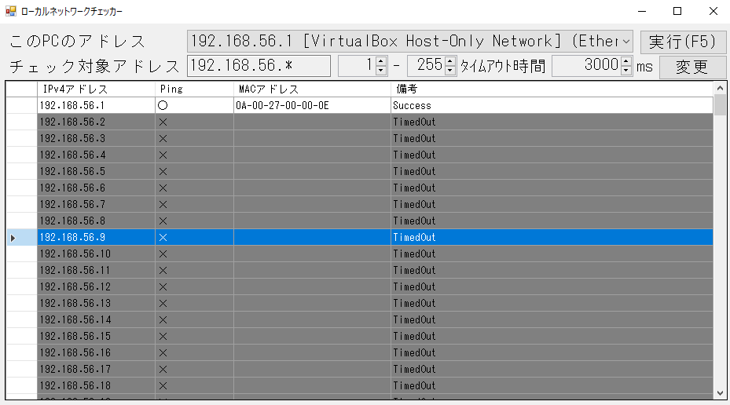

# LocalNetworkChecker ローカルネットワークチェッカー

## キャプチャ画像

## 概要

- 自PCが属しているネットワークの周辺にあるホストに対し、PINGを送信して反応を調べます。
  - PING応答があれば、ARP情報を基にMACアドレスも調べます。
  - IgNetMap や NetEnum のようなアプリがほしくて作りました。
    - IgNetMap
      - https://forest.watch.impress.co.jp/article/2006/01/24/ignetmap.html
    - NetEnum5
      - https://forest.watch.impress.co.jp/library/software/netenum/

## 動作

- 起動するとキャプチャ画像のような画面が表示されます。
  - 「このPCのアドレス」という文言の右横には選択リストが表示されます。
    - このアプリを実行しているPCに存在するネットワークインタフェースと、それに対応するIPアドレスが選択肢として並びます。
    - ただし、ループバックインタフェースや起動していないインタフェースは除外されます。
  - 「チェック対象アドレス」の欄には、選択リストで選択したIPアドレスの第4オクテットが「*」になったものが表示されます。
  - 「実行」ボタンをクリックすると、「チェック対象アドレス」の「*」を1から255の値にしたIPアドレスに対し、PINGを送信し、結果をグリッドに表示します。
    - 「変更」ボタンをクリックすると、1から255以外にも変更できます。
      - タイムアウト時間もデフォルトの3秒から変更できます。

## 備考

- ライセンスはMITにしました。
  - ご利用はご自由にどうぞ…
